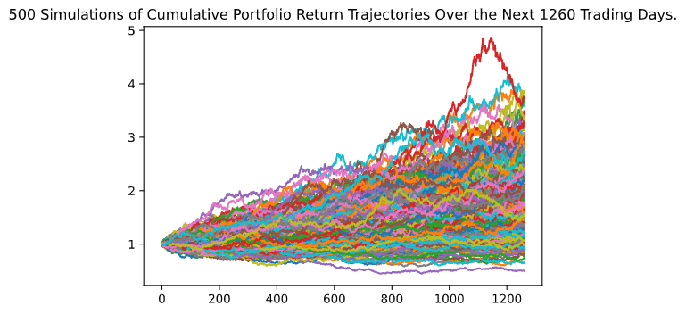
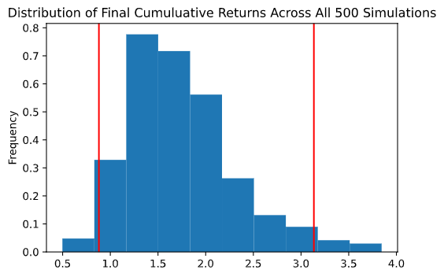

# API and Monte Carlo Simiulation 

This is a personal finance planner that allows users to visualize their savings composed by investments in shares and cryptocurrencies to assess if they have enough money as an emergency fund.

This also contains a retirement planning tool that will use the Alpaca API to fetch historical closing prices for a retirement portfolio composed of stocks and bonds, then run Monte Carlo simulations to project the portfolio performance at 30/5/10 years. 

I have used the Monte Carlo data to calculate the expected portfolio returns given a specific initial investment amount.

# Crypto and Shares investment portfolio

* Assumption is that the portfolio contains 1.2 Bitcoin units and 5.30 Ethereum units
* Additionally, it contains AGG 200 units and SPY 50 units
* Crypto prices are obtained using api.alternative.me
* Bond (AGG) and share (SPY) prices are obtained using Alpaca API

The chart shows portfolio composition

# Retirement Planning using Monte Carlo Simulation

## First Simulation -  Base Case
* Alpaca API is used to obtain historical prices *(5 years)* for AGG and SPY
* Monte Carlo simulation is used to forecast 30 years cumulative returns
* Weights of `60%` for stocks (`SPY`) and `40%` for bonds (`AGG`) is considered for composition of the portfolio

### Based on this simulation

*When intital investment is $20,000*:
There is a 95% chance that an initial investment of `$20000` in the `40%` debt portfolio over the next 30 years will end within in the range of $61771.27 and $1012985.03

*When the initial investment is $30,000*:
There is a 95% chance that an initial investment of `$30000.0` in the `40%` debt portfolio over the next 30 years will end within in the range of $92656.91 and $1519477.54

## Second Simulation - Early Retirement Option

* Weights are changed to `70%` for stocks (`SPY`) and `30%` for bonds (`AGG`) for the portfolio to include more risk and thereby expect higher return

### Monte Carlo simulation to forecast `5 years` cumulative returns

#### Based on this simulation

*When initial investment is increased to $60000 and investments are held for the next five years*:
There is a 95% chance that an initial investment of `$60000` in the portfolio `(30% debt allocation)` over the next 5 years will end within in the range of $52817.08 and $188079.51

### Monte Carlo simulation to forecast `10 years` cumulative returns

#### Based on this simulation

*When initial investment is increased to $60000 and investments are held for the next ten years*:
There is a 95% chance that an initial investment of $60000 in the portfolio `(30% debt allocation)` over the next `10 years` will end within in the range of $65640.28 and $378578.5
